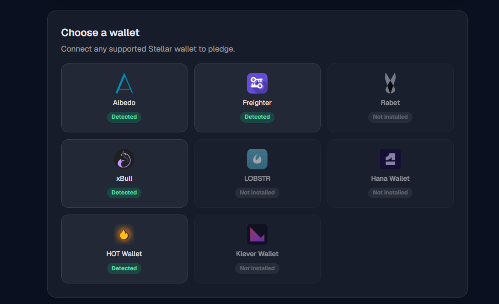
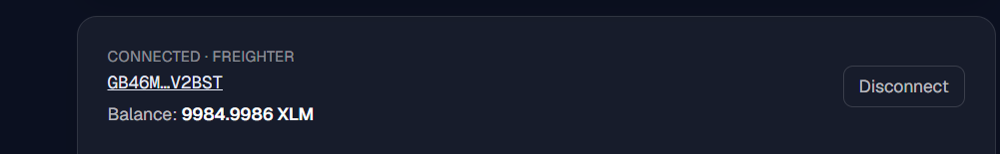

# 🥋 Stellar Crowdfund — Yellow Belt dApp

A multi-wallet **Soroban** crowdfunding dApp on the **Stellar Testnet**. Pledge testnet XLM by invoking a token **smart contract**, watch the progress bar and activity feed **sync from on-chain contract events in real time**, and track your transaction from *pending* to *confirmed*.

Built for the Rise In **Yellow Belt** challenge (Level 2).

**🔗 Live demo:** https://stellar-yellow-belt-navy.vercel.app/
**💻 Source:** https://github.com/Yormee-103/stellar-yellow-belt

> Stack: **Next.js 15 (App Router)**, **Tailwind CSS v4**, **StellarWalletsKit** (multi-wallet), `@stellar/stellar-sdk` (Soroban RPC), and the **Stellar CLI** for contract deployment.

---

## What it does (Level 2 requirements)

| Requirement | How it's met |
|---|---|
| **Multi-wallet integration** | `StellarWalletsKit` with `allowAllModules()` — Freighter, xBull, Albedo, Lobstr, Rabet, Hana, and more. A wallet grid shows which are detected. |
| **Contract deployed on testnet** | A **FUND** Stellar Asset Contract we deployed via the Stellar CLI (address + deploy tx below). |
| **Contract called from the frontend** | Pledging invokes `transfer(from, to, amount)` on the token contract via Soroban RPC (`simulate → prepare → sign → send`). |
| **Reading & writing contract data** | *Reads:* FUND token `name`/`symbol`/`decimals` and the campaign `balance`. *Writes:* the `transfer` pledge. |
| **Real-time event integration** | Polls Soroban `getEvents` for `transfer` events to the campaign every 5s → live progress bar + "Live pledges" feed. |
| **Transaction status tracking** | A stepper shows `building → signing → submitting → pending → confirmed`, polling `getTransaction` until final. |
| **3+ error types handled** | (1) wallet not found / not installed, (2) user rejected the signature, (3) insufficient balance — each classified and shown distinctly. |

---

## On-chain details (Stellar Testnet)

- **FUND token contract (deployed by us):**
  `CDIYLEBXTJKNTJF56AFXOMOANHNZZW6SHQ7AB6B2KJZ7TSNLCUEC6IJE`
  Deploy tx: `bb3d26aa644e814d853c7a8e203a28107d820031cbc4f0f227788e2dbc280352`
  → https://stellar.expert/explorer/testnet/contract/CDIYLEBXTJKNTJF56AFXOMOANHNZZW6SHQ7AB6B2KJZ7TSNLCUEC6IJE

- **Pledge token contract (native XLM SAC, used for `transfer` + events):**
  `CDLZFC3SYJYDZT7K67VZ75HPJVIEUVNIXF47ZG2FB2RMQQVU2HHGCYSC`

- **Campaign beneficiary account:**
  `GBIYZWNE6HGKGGT2G73W6F7ZXXRQ2LP3RGLYIOOTZH6557A3EEBB4S7D`

- **Example contract-call transaction (a `transfer` pledge, verifiable on Explorer):**
  `672a3701421a40f14cb7aec805e80e4ec033e08073533720819727fd5059a0a9`
  → https://stellar.expert/explorer/testnet/tx/672a3701421a40f14cb7aec805e80e4ec033e08073533720819727fd5059a0a9

---

## Why two contracts?

The FUND asset contract is the one **we deployed** (proof of the deploy skill), and the app reads its live metadata. Pledges themselves are made in **XLM through the native token contract** so that **anyone with testnet XLM can pledge without first setting up a trustline** — a smoother, more reliable demo. Both are genuine Soroban contract calls.

---

## Screenshots

**Wallet options available** (multi-wallet picker)



**Connected wallet**



**Confirmed contract-call transaction** (pending → confirmed, with hash)


---

## Run locally

**Prerequisites:** Node 18+ and a Stellar wallet browser extension (e.g. [Freighter](https://freighter.app)) set to **Testnet** with a funded account.

```bash
# 1. clone
git clone <your-repo-url>
cd <repo>

# 2. install
npm install

# 3. run
npm run dev
# open the printed URL (e.g. http://localhost:3000)
```

Then: **Choose a wallet → connect → enter an amount → Pledge XLM → approve in your wallet.** The progress bar and live feed update automatically.

> Need testnet XLM? Fund your address at the [Stellar Friendbot](https://friendbot.stellar.org) or the Freighter faucet.

---

## How the contract was deployed

The FUND token contract was deployed with the [Stellar CLI](https://developers.stellar.org/docs/tools/cli):

```bash
# identity + funding
stellar keys generate crowdfund --network testnet --fund

# deploy the FUND asset as a Stellar Asset Contract
stellar contract asset deploy \
  --asset FUND:$(stellar keys address crowdfund) \
  --source crowdfund --network testnet
```

## Project structure

```
app/
  page.js            # main crowdfunding UI (client component)
  layout.js          # metadata + fonts
components/
  WalletGrid.jsx     # multi-wallet picker ("wallet options available")
  TxStatus.jsx       # pending → success/fail stepper
lib/
  config.js          # network + contract addresses
  wallet.js          # StellarWalletsKit integration
  soroban.js         # contract calls, reads, events, tx polling, error types
```

---

## Network

Stellar **Testnet** · Soroban RPC `https://soroban-testnet.stellar.org` · Horizon `https://horizon-testnet.stellar.org`
