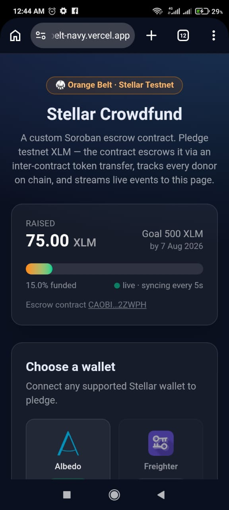
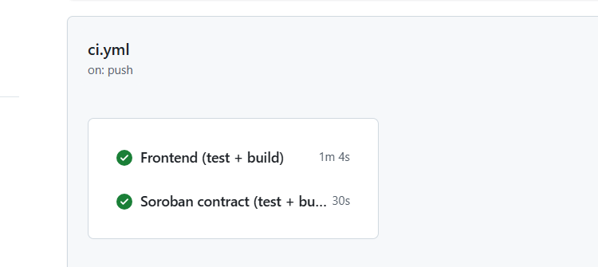
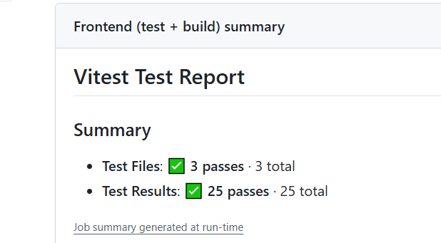
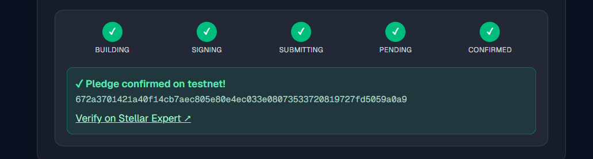

# 🥋 Stellar Crowdfund — Orange Belt dApp

A production-shaped **Soroban** crowdfunding dApp on the **Stellar Testnet**, built around a **custom Rust smart contract** that escrows pledges. Donors pledge testnet XLM; the contract pulls the tokens in via an **inter-contract call**, tracks every donor on chain, and streams live events to a mobile-responsive Next.js frontend. If the goal is met the beneficiary can withdraw; if the deadline passes unmet, donors can refund.

Built for the Rise In **Orange Belt** challenge (Level 3).

**🔗 Live demo:** https://stellar-yellow-belt-navy.vercel.app/
**💻 Source:** https://github.com/Yormee-103/stellar-yellow-belt

> Stack: **Rust / Soroban SDK 22** (custom contract) · **Next.js 15 (App Router)** · **Tailwind CSS v4** · **StellarWalletsKit** (multi-wallet) · `@stellar/stellar-sdk` (Soroban RPC) · **Vitest** + **cargo test** · **GitHub Actions** CI/CD · **Vercel**.

---

## Level 3 requirements → where they're met

| Requirement | How it's met |
|---|---|
| **Advanced smart contract** | Custom Rust `crowdfund` escrow contract: `pledge` / `withdraw` / `refund`, per-donor on-chain ledger, goal + deadline gating, typed `#[contracterror]` errors. → [contracts/crowdfund/src/lib.rs](contracts/crowdfund/src/lib.rs) |
| **Inter-contract communication** | The contract calls `token::Client::transfer(...)` on a *separate* token contract to move funds into/out of its own escrow address. One `pledge` tx emits **both** a token `transfer` event and the crowdfund `pledge` event. |
| **Event streaming & real-time updates** | Frontend polls Soroban `getEvents` for the contract's `pledge` events every 5s → live progress bar + activity feed; totals read straight from `total_raised()`. |
| **Smart contract testing** | 10 Rust unit tests (`cargo test`) exercise pledging, escrow balances, withdrawal, refunds, and every error path against a real Stellar Asset Contract. |
| **Frontend testing** | 25 Vitest tests over unit conversion, error classification, and a component render test. |
| **CI/CD pipeline** | GitHub Actions builds + tests the contract (wasm artifact) and the frontend on every push/PR; a deploy workflow ships the frontend to Vercel. → [.github/workflows](.github/workflows) |
| **Deployment workflow** | One-command [scripts/deploy.sh](scripts/deploy.sh): build wasm → deploy → initialize campaign → print the address + env var. |
| **Mobile responsive** | Fluid layout, stacked controls on small screens, `viewport` meta, tap-friendly targets. |
| **Error handling & loading states** | Typed errors (wallet / rejected / insufficient / mapped contract reverts), a `building→signing→submitting→pending→confirmed` stepper, and skeleton/"…" loading states. |
| **Production architecture** | Pure, tested lib modules (`units`, `errors`) split from SDK/DOM code; env-configurable contract id; optimized release wasm profile. |

---

## The smart contract

A crowdfunding **escrow** contract — full write-up in [contracts/README.md](contracts/README.md).

| Function | Auth | Description |
|---|---|---|
| `initialize(admin, beneficiary, token, goal, deadline)` | admin | One-time campaign setup. |
| `pledge(donor, amount) -> raised` | donor | Escrows tokens via an **inter-contract** `transfer`; records the donor. |
| `withdraw() -> amount` | beneficiary | Sends the pot to the beneficiary once the goal is met. |
| `refund(donor) -> amount` | donor | Returns a donor's contribution after a failed deadline. |
| `total_raised` / `pledged_by` / `goal` / `deadline` / `goal_reached` / `beneficiary` / `token` | — | Read-only views. |

**Why it's genuinely inter-contract:** `pledge`, `withdraw`, and `refund` each construct a `token::Client` for a *different* deployed contract and invoke its `transfer` — the crowdfund contract holds and moves real tokens at `env.current_contract_address()`. The event log of a single pledge proves it (token `transfer` + crowdfund `pledge` in one tx).

---

## On-chain details (Stellar Testnet)

- **Custom crowdfund contract (Rust, deployed by us):**
  `CAOBIEYX3QTUV3AKZ2XEPWZIXJRGTGJ7YM3GDK3BTXJ4DTOGSLF2ZWPH`
  → https://stellar.expert/explorer/testnet/contract/CAOBIEYX3QTUV3AKZ2XEPWZIXJRGTGJ7YM3GDK3BTXJ4DTOGSLF2ZWPH
  - Wasm hash: `6a11605a35fecc6d61e24162bb852dcd713ad65b90ed189abb8686597be54bfe`
  - **Deploy tx:** `bcab50e8dccc85c845e96c45b29b6472ac8b8ea34b5bd8efacdd6ed4c5b56d78`
  - Initialize tx: `c5eff4ac57884e1bf67810ba392e0fc7af9f4c36a54b1a794c9d4e5a099fa634`

- **Example contract-call transaction — a real `pledge` (inter-contract transfer):**
  `e2651dd4e70b9b558db37f7a14f52ad979472dbf23f49d0a753bb097fefb3189`
  → https://stellar.expert/explorer/testnet/tx/e2651dd4e70b9b558db37f7a14f52ad979472dbf23f49d0a753bb097fefb3189

- **Pledge token (native XLM Stellar Asset Contract):**
  `CDLZFC3SYJYDZT7K67VZ75HPJVIEUVNIXF47ZG2FB2RMQQVU2HHGCYSC`

- **FUND token (SAC from Level 2, still read for live metadata):**
  `CDIYLEBXTJKNTJF56AFXOMOANHNZZW6SHQ7AB6B2KJZ7TSNLCUEC6IJE`

- **Beneficiary / admin:** `GDK5XNJWQTEGIS7R2ZDOM4GC5TUVUTCQPUA6MFF7RN6DGN6HMAQAO5C5`

> Native XLM is used as the pledge token so anyone with testnet XLM can pledge without setting up a trustline — a smoother demo. It's still a genuine Soroban token contract call driven by our escrow contract.

---

## Screenshots

**Mobile responsive UI**



**CI/CD pipeline running**



**Test output (contract + frontend, 3+ passing)**



**Confirmed contract-call transaction** (pending → confirmed, with hash)



---

## Repository layout

```
app/                     # Next.js App Router UI (client component)
components/               # WalletGrid, TxStatus
lib/
  config.js               # network + contract addresses (env-overridable)
  units.js                # pure unit helpers (tested)
  errors.js               # typed errors + contract-error mapping (tested)
  soroban.js              # contract calls, reads, event streaming, tx polling
  wallet.js               # StellarWalletsKit multi-wallet integration
contracts/
  crowdfund/src/lib.rs     # the custom Soroban contract
  crowdfund/src/test.rs    # 10 unit tests
test/                     # Vitest suites (units, errors, TxStatus)
scripts/deploy.sh         # build → deploy → initialize on testnet
.github/workflows/        # ci.yml (test/build) + deploy.yml (Vercel)
```

---

## Run locally

**Prerequisites:** Node 18+, a Stellar wallet extension (e.g. [Freighter](https://freighter.app)) set to **Testnet** with a funded account.

```bash
git clone https://github.com/Yormee-103/stellar-yellow-belt
cd stellar-yellow-belt
npm install
npm run dev          # open the printed URL (e.g. http://localhost:3000)
```

Then: **choose a wallet → connect → enter an amount → Pledge XLM → approve.** The progress bar, your pledged total, and the live feed update automatically.

> Need testnet XLM? Fund your address at the [Stellar Friendbot](https://friendbot.stellar.org).

---

## Tests

```bash
# Frontend (Vitest) — 25 tests
npm test

# Contract (cargo) — 10 tests
cd contracts && cargo test
```

> On Windows the contract's host test link needs LLVM `lld` (configured in `contracts/.cargo/config.toml`); CI runs on Ubuntu with no extra setup.

---

## Build & deploy the contract

```bash
# build the optimized wasm
cd contracts && stellar contract build

# or do everything (build → deploy → initialize) and print the address:
./scripts/deploy.sh
```

Set the printed id as `NEXT_PUBLIC_CROWDFUND_CONTRACT_ID` locally and in Vercel.

---

## CI/CD

- **[ci.yml](.github/workflows/ci.yml)** — on every push/PR: `npm ci` → Vitest → `next build`; and in parallel `cargo test` → `stellar contract build` → upload the wasm artifact.
- **[deploy.yml](.github/workflows/deploy.yml)** — on push to `main`: builds and deploys the frontend to Vercel (skips cleanly if `VERCEL_TOKEN` isn't set, so Vercel's own Git integration can handle it instead).

---

## Network

Stellar **Testnet** · Soroban RPC `https://soroban-testnet.stellar.org` · Horizon `https://horizon-testnet.stellar.org`
